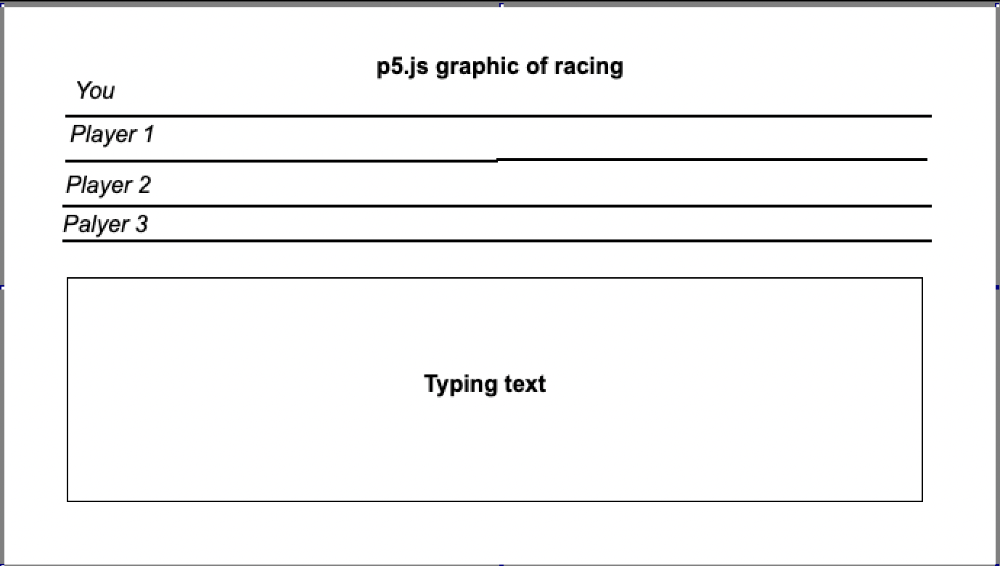

# Roll-On
Connections Lab Midterm Project

Run the following code:
```
npm install
npm start
```
## Project Concept & Idea

We want to create a multiplayer browser-based online typing game. In this game, players pass tests of a set of different texts as quickly as possible, competing with themselves or with other online users.

## Wireframe of the game



